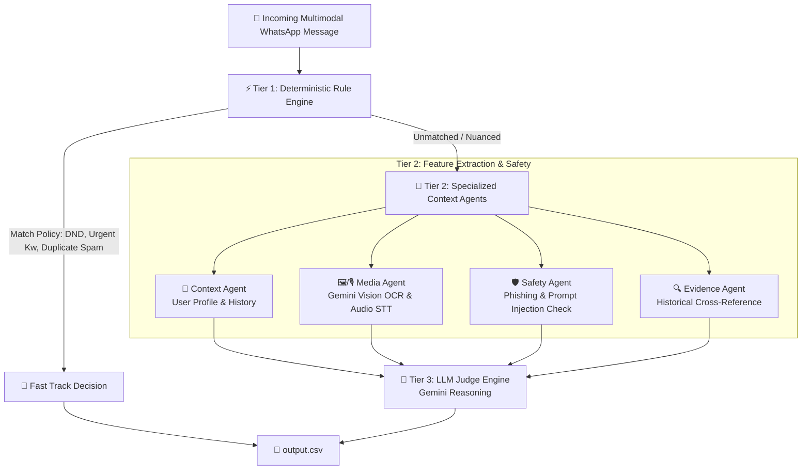

# WhatsApp Message Notification Router (AI Orchestrator)

[](https://www.python.org/)
[](https://ai.google.dev/)
[](https://www.hackerrank.com/)
[](LICENSE)

> An intelligent, production-grade, 3-Tier Cascading AI Notification Routing Engine built for WhatsApp. It processes text, multimodal images (OCR), and voice notes (speech-to-text), contextualizes user profiles and interaction histories, and dynamically triages incoming messages into **`notify`**, **`digest`**, or **`mute`**.

---

## 🌟 Executive Summary

In modern messaging platforms, notification overload degrades user focus, while aggressive muted notifications cause missed urgent alerts. Standard heuristic filters fail on complex multimodal content (voice notes, image screenshots) and contextual nuances (family emergencies vs. group spam).

This project presents an **AI-powered Notification Router** designed to deliver **personalized, context-aware notification management**. By combining a **zero-cost Python Rule Engine**, **Specialized Contextual Agents**, and **Google Gemini Multimodal LLMs**, the router achieves optimal decision accuracy while minimizing latency and API costs.

---

## 🏗️ 3-Tier Cascading Architecture

The router uses a 3-tier cascade funnel to minimize expensive LLM calls and ensure sub-second response times for obvious notifications/mutes.



### Tier Breakdown

| Tier | Component | Function | Latency / Cost |
| :--- | :--- | :--- | :--- |
| **Tier 1** | **Deterministic Rule Engine** ([code/rule_engine.py](file:///d:/ANUP/hackkerrank%20aug%20edition/hackerrank-orchestrate-august26/code/rule_engine.py)) | Instant matching for Do-Not-Disturb rules, explicit emergency keywords, exact-string spam, and security filters. | `~0ms` / `$0.00` |
| **Tier 2** | **Context & Multimodal Extraction** ([code/agents/](file:///d:/ANUP/hackkerrank%20aug%20edition/hackerrank-orchestrate-august26/code/agents/)) | Enriches message with user interaction history, group membership roles, OCR scan of image media, and audio transcription of voice notes. | `~200ms` / Low |
| **Tier 3** | **LLM Judge Engine** ([code/agents/judge_agent.py](file:///d:/ANUP/hackkerrank%20aug%20edition/hackerrank-orchestrate-august26/code/agents/judge_agent.py)) | Generates structured JSON routing decision (`notify`, `digest`, `mute`), confidence score, plain-English reason, and historical evidence IDs. | `~800ms` / Optimized |

---

## 🔥 Key Technical Highlights

- **🧠 Multimodal Intelligence**: Directly parses voice notes (`.mp3`) and image attachments (`.jpg`) using Gemini API for full vision and speech comprehension.
- **🛡️ Prompt Injection & Security Guardrails**: Detects and neutralizes malicious prompt injections, phishing attempts, and scam chains before routing decisions are formed.
- **📊 Personalized Context Synthesis**: Dynamically analyzes user interaction history, business account reliability, group dynamics, and past engagement patterns.
- **⚡ Rate-Limit Resilient**: Implements dynamic rate limiting (4s backoff per call) to operate seamlessly within free-tier API quotas (15 RPM) without throttling or failures.
- **📈 High Precision Evaluation**: Includes an automated evaluation suite to benchmark predictions against ground-truth datasets.

---

## 🛠️ Tech Stack & Dependencies

- **Language**: Python 3.9+
- **AI / LLM Framework**: Google Generative AI (Gemini 1.5 / 3.5 / 3.6 Flash)
- **Data Engineering**: Pandas, NumPy
- **Environment Management**: Python Dotenv

---

## 📁 Project Structure

```text
.
├── dataset/                         # WhatsApp evaluation dataset
│   ├── messages.csv                 # Target messages to route (111 rows)
│   ├── sample_messages.csv          # Ground-truth sample dataset
│   ├── users.csv                    # User profile metadata
│   ├── groups.csv & group_members.csv # Group metadata & membership roles
│   ├── business_accounts.csv        # Business account verification status
│   ├── message_history.csv          # Historical chat logs
│   ├── media/                       # Multimodal media assets
│   │   ├── images/                  # Image attachments / screenshots
│   │   └── audio/                   # Voice note audio files (.mp3)
│   └── output.csv                   # Target output destination
├── code/                            # Core application logic
│   ├── main.py                      # Primary application entry point
│   ├── orchestrator.py              # 3-Tier Cascading Orchestrator logic
│   ├── rule_engine.py               # Tier 1 Rule Engine
│   ├── data_loader.py               # Dataset loading & indexing
│   ├── agents/                      # Specialized Agent Suite
│   │   ├── context_agent.py         # User & Group context builder
│   │   ├── media_agent.py           # OCR & Voice transcription agent
│   │   ├── safety_agent.py          # Security & injection analyzer
│   │   ├── evidence_agent.py        # Historical evidence matcher
│   │   └── judge_agent.py           # Final LLM decision engine
│   └── evaluation/
│       └── main.py                  # Ground-truth accuracy scorer
├── README.md                        # Project documentation
└── requirements.txt                 # Dependencies
```

---

## 🚀 Quickstart Guide

### 1. Clone & Prerequisites

Ensure Python 3.9+ is installed on your system.

```bash
git clone <your-github-repo-url>
cd hackerrank-orchestrate-august26
```

### 2. Environment Setup

Create and activate a virtual environment (optional but recommended):

```bash
# macOS/Linux
python3 -m venv venv
source venv/bin/activate

# Windows (PowerShell)
python -m venv venv
.\venv\Scripts\Activate.ps1
```

Install dependencies:

```bash
pip install -r code/requirements.txt
```

### 3. API Key Configuration

Create a `.env` file in the root directory and add your Google Gemini API key:

```env
GEMINI_API_KEY="your_google_gemini_api_key_here"
```

---

## 🧪 Execution & Evaluation

### Run Notification Router

To process all messages in `dataset/messages.csv` and generate `dataset/output.csv`:

```bash
python code/main.py
```

### Run Evaluation Harness

To score the pipeline against ground-truth samples in `dataset/sample_messages.csv`:

```bash
python code/evaluation/main.py
```

---

## 📋 Output Contract

The pipeline outputs `dataset/output.csv` with the following 6 mandatory columns:

```csv
message_id,action,message_type,reason,confidence,evidence_message_ids
```

- **`action`**: `notify` (immediate alert), `digest` (batch for later), `mute` (suppress/ignore).
- **`message_type`**: `text`, `image`, or `voice_note`.
- **`reason`**: Short plain-English explanation for the routing decision.
- **`confidence`**: Numeric confidence score (`0.0` - `1.0`).
- **`evidence_message_ids`**: Referenced historical `message_id`s or `none`.

---

## 📜 License

Distributed under the MIT License. See `LICENSE` for more information.
